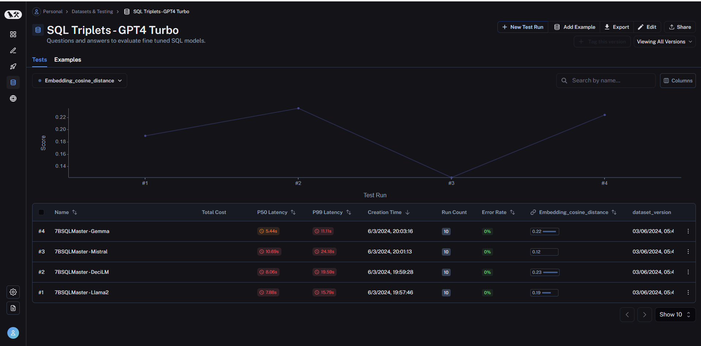
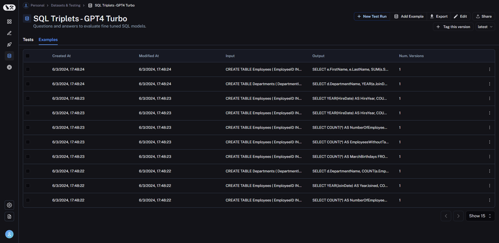
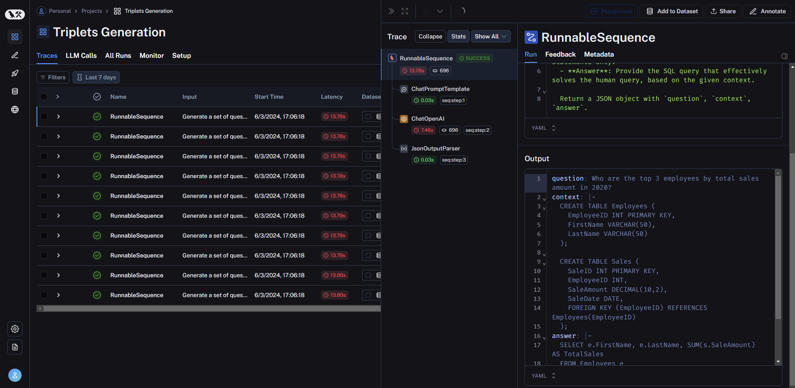
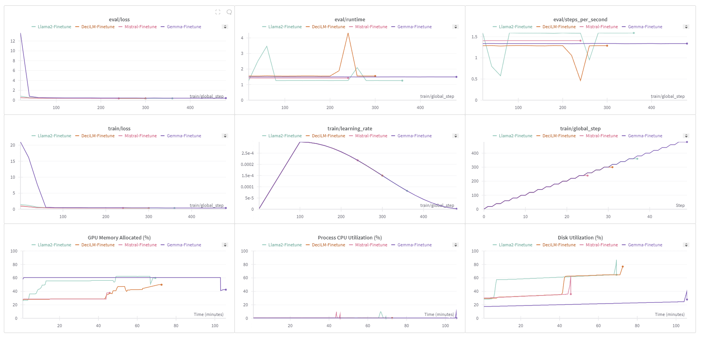

# 7B-SQLMaster - Fine-tuning Large Language Models for Text-to-SQL Task

This project focuses on fine-tuning four large language models - Gemma, Mistral, DeciLM, and LLama2 - each with 7 billion parameters, for the task of generating SQL queries from natural language input. The models are trained on the [SQL Create Context dataset](https://huggingface.co/datasets/b-mc2/sql-create-context), which provides a context of relevant database tables along with user queries. The goal is to enable the models to understand the user's intent and generate the appropriate SQL query to fetch the required information.

The models were fine-tuned using the following techniques and hardware:
- **LoRA (Low-Rank Adaptation)**: LoRA is a parameter-efficient fine-tuning method that adapts pre-trained language models to downstream tasks by adding a small number of trainable parameters.
- **NVIDIA A100 80GB**: The fine-tuning process was performed on NVIDIA A100 GPUs with 80GB of memory, providing ample computational resources for training the large language models.

To monitor the training process and evaluate the fine-tuned models' performance, the following tools and methods were employed:
- **Weights and Biases (W&B)**: W&B is a platform for experiment tracking and visualization. The training progress, evaluation metrics, and hardware usage were logged and can be accessed in the W&B section of this repository.
- **LangSmith**: LangSmith was used to create a dataset for evaluating the models' performance on unseen data. The evaluation metric used was the embedding distance (used `text-embedding-3-large` from OpenAI) between the generated SQL queries and the ground truth (`gpt-4-0125-preview`). You can find the details [here](https://github.com/jjovalle99/7b-SQLMaster-FineTune/blob/ab4f3445ec4e101c16d0639dcb4f96c8b1a5be4d/langsmith.ipynb). Since in the evaluation process all the fine-tuned models generated answers for the evaluation samples, **flash-attention** was used to speed up the inference.

| Final Rank | Model |  HF Repo                   |  Finetune Notebook                   |
|------|---------|---------------------------|---------------------------|
| 3 | Gemma 7B  | [gemma7b-ft-lora-sql-v2](https://huggingface.co/jjovalle99/gemma7b-ft-lora-sql-v2)     | [gemma-7b-sql-fine-tune-lora.ipynb](https://github.com/jjovalle99/7b-SQLMaster-FineTune/blob/7bb695f2c6f879e7e7fd0faa9c9a2a698a539452/gemma-7b-sql-fine-tune-lora.ipynb)|
| 1 | Mistral 7B   | [mistral7b-ft-lora-sql-v2](https://huggingface.co/jjovalle99/mistral7b-ft-lora-sql-v2)    | [mistral-7b-sql-fine-tune-lora.ipynb](https://github.com/jjovalle99/7b-SQLMaster-FineTune/blob/7bb695f2c6f879e7e7fd0faa9c9a2a698a539452/mistral-7b-sql-fine-tune-lora.ipynb) |
| 4 | DeciLM 7B   | [deci7b-ft-lora-sql-v2](https://huggingface.co/jjovalle99/deci7b-ft-lora-sql-v2)    | [deci-7b-sql-fine-tune-lora.ipynb](https://github.com/jjovalle99/7b-SQLMaster-FineTune/blob/7bb695f2c6f879e7e7fd0faa9c9a2a698a539452/deci-7b-sql-fine-tune-lora.ipynb) |
| 2 | LLama2 7B   | [llama7b-ft-lora-sql-v2](https://huggingface.co/jjovalle99/llama7b-ft-lora-sql-v2)     | [llama2-7b-sql-fine-tune-lora.ipynb](https://github.com/jjovalle99/7b-SQLMaster-FineTune/blob/7bb695f2c6f879e7e7fd0faa9c9a2a698a539452/llama2-7b-sql-fine-tune-lora.ipynb) |

# LangSmith 
## Evaluation
```python
for name, model_name in zip(names, models):

    print(f"Loading {name}...")
    hf_pipeline = load_langchain_hugging_face_pipeline(model_name=model_name)
    chain = initial_chain | hf_pipeline
    print(f"Load Complete!")

    print(f"Evaluating {name}...")
    await arun_on_dataset(
        dataset_name=dataset_name,
        llm_or_chain_factory=chain,
        evaluation=evaluation_config,
        client=client,
        project_name=f"7BSQLMaster - {name}",
        verbose=True
    )
    print(f"Evaluation complete...")

    del chain
    del hf_pipeline
    torch.cuda.empty_cache()
    sleep(10)
    
```


## Dataset Creation
```python
client = Client()
dataset_name = "SQL Triplets - GPT4 Turbo"
if client.has_dataset(dataset_name=dataset_name):
    print("Dataset already exists")
else: 
    dataset = client.create_dataset(
        dataset_name=dataset_name,
        description="Questions and answers to evaluate fine tuned SQL models.",
    )
    for triplet in triplets:
        client.create_example(
            inputs={k: v for k, v in triplet.items() if k != "answer"},
            outputs={k: v for k, v in triplet.items() if k == "answer"},
            dataset_id=dataset.id,
        )
```


## Triplets Generation
```python
user = """Generate a set of question, context, and answer for querying a SQL database:

- **Question**: Pose a human query related to a specific task or information retrieval from a SQL database.
- **Context**: Describe the data table structure relevant to the question, using `CREATE TABLE` statements only.
- **Answer**: Provide the SQL query that effectively solves the human query, based on the given context.

Return a JSON object with `question`, `context`, `answer`.
"""

one_shot = """```json
{
  "question": "Find the total revenue generated from orders placed by customers in the USA for each product category in the year 2022.",
  "context": "CREATE TABLE Customers (\n  CustomerID INT PRIMARY KEY,\n  CustomerName VARCHAR(50),\n  Country VARCHAR(50)\n);\n\nCREATE TABLE Orders (\n  OrderID INT PRIMARY KEY,\n  CustomerID INT,\n  OrderDate DATE,\n  FOREIGN KEY (CustomerID) REFERENCES Customers(CustomerID)\n);\n\nCREATE TABLE OrderDetails (\n  OrderDetailID INT PRIMARY KEY,\n  OrderID INT,\n  ProductID INT,\n  Quantity INT,\n  FOREIGN KEY (OrderID) REFERENCES Orders(OrderID),\n  FOREIGN KEY (ProductID) REFERENCES Products(ProductID) \n);\n\nCREATE TABLE Products (\n  ProductID INT PRIMARY KEY,\n  ProductName VARCHAR(100),\n  CategoryID INT,\n  Price DECIMAL(10,2),\n  FOREIGN KEY (CategoryID) REFERENCES Categories(CategoryID)\n);\n\nCREATE TABLE Categories (\n  CategoryID INT PRIMARY KEY,\n  CategoryName VARCHAR(50)\n);",
  "answer": "SELECT c.CategoryName, SUM(p.Price * od.Quantity) AS TotalRevenue\nFROM OrderDetails od\nJOIN Orders o ON od.OrderID = o.OrderID\nJOIN Customers cu ON o.CustomerID = cu.CustomerID\nJOIN Products p ON od.ProductID = p.ProductID  \nJOIN Categories c ON p.CategoryID = c.CategoryID\nWHERE cu.Country = 'USA' AND o.OrderDate BETWEEN '2022-01-01' AND '2022-12-31'\nGROUP BY c.CategoryName;"
}
```"""
human_template = HumanMessagePromptTemplate.from_template("{user_input}")
template = ChatPromptTemplate.from_messages([
    HumanMessage(content=user),
    AIMessage(content=one_shot),
    human_template
])
llm = ChatOpenAI(
    model="gpt-4-0125-preview",
    temperature=0.8,
)
parser = SimpleJsonOutputParser()
chain = template | llm | parser

with tracing_v2_enabled(project_name="Triplets Generation"):
    triplets = await chain.abatch([{"user_input": user}] * 10)
```


# [W&B Fine-Tuning Report](https://wandb.ai/jj-ovalle/7bsqlmaster/reports/-Full-FineTuning-Results-7B-Models--Vmlldzo3MDUzNzgw)
